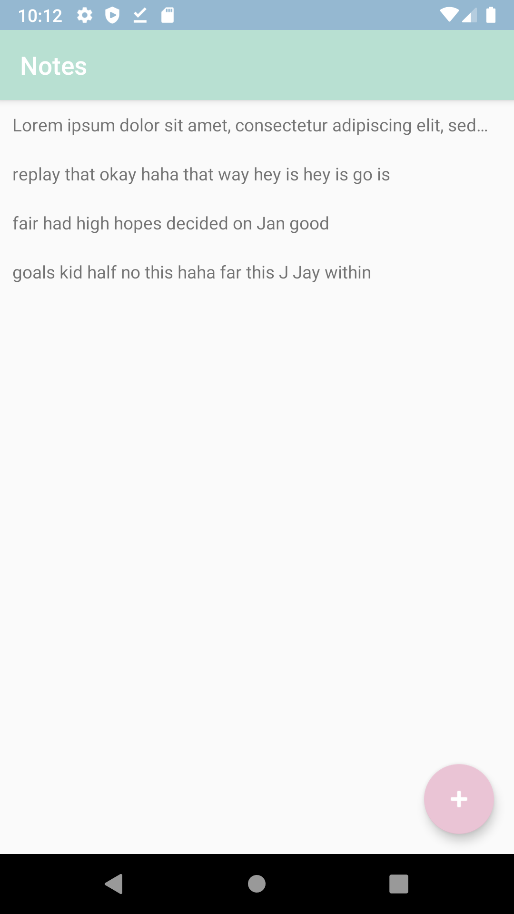
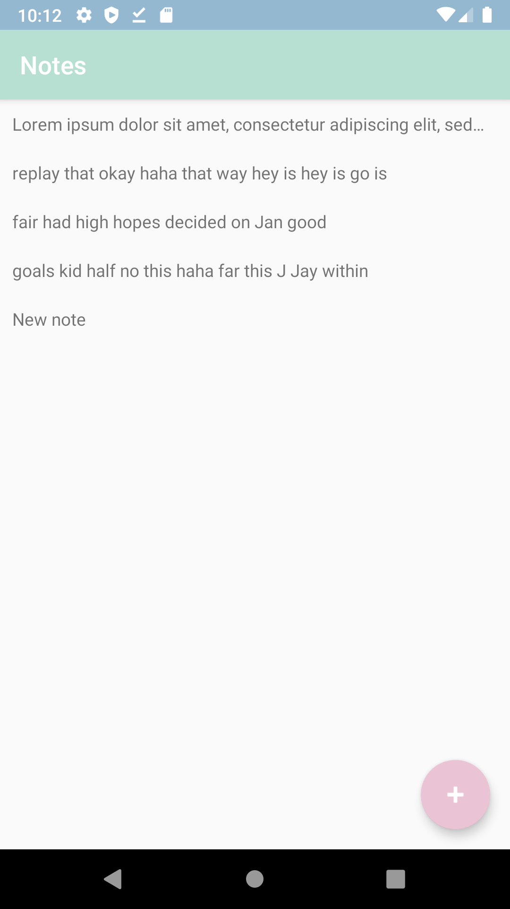
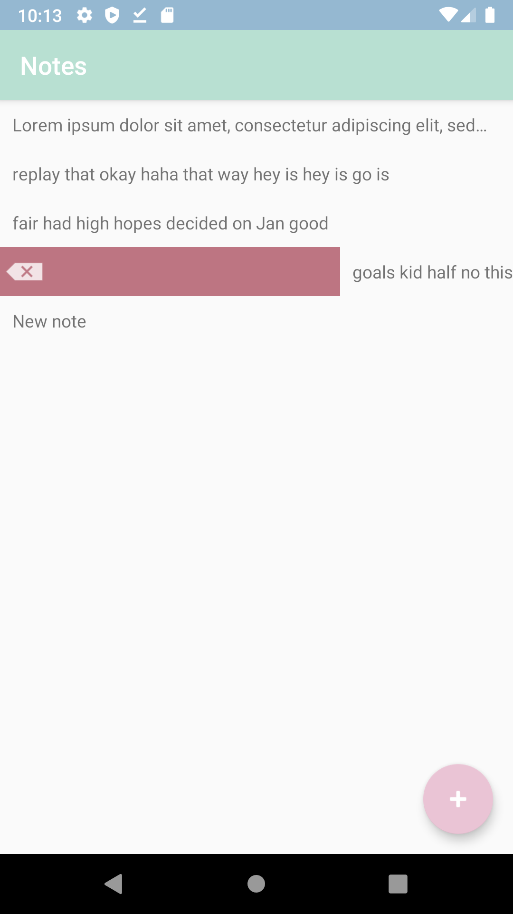
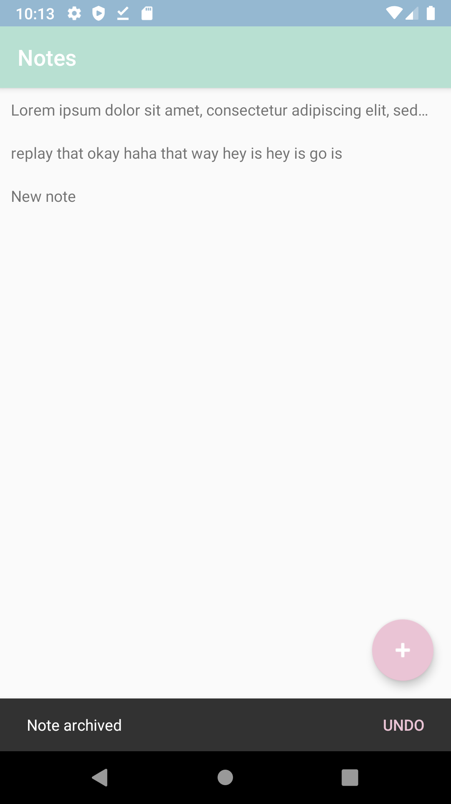

# Notes Android

A note taking Android app, developed following [Harvard's CS50 Android Track](https://cs50.harvard.edu/x/2020/tracks/mobile/android/notes/).

## Main view

## Add notes

## Delete notes

## Archive notes

